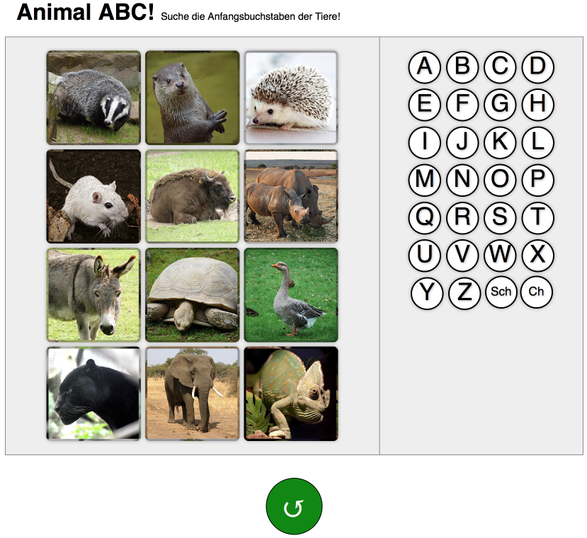

Animal ABC
===========

A small game for little kids learning the letters of the ABC. The goal is to present
a bunch of letters and a bunch of pictures. The kid then can select a letter and the corresponding
image which animal starts with the letter, and it is either "hooray!" or "booooh".

Check it out online: http://animal-abc.alexi.ch/

Sounds from:
  - http://soundbible.com
  - http://www.freeinfosociety.com
  - https://www.freesound.org
  - http://www.orangefreesounds.com

Images from:
  - https://pixabay.com

This project uses ReactJS, grunt, webpack, BabelJS and a lot of sweat.

(c) 2016 Alexander Schenkel and the noted media sources
